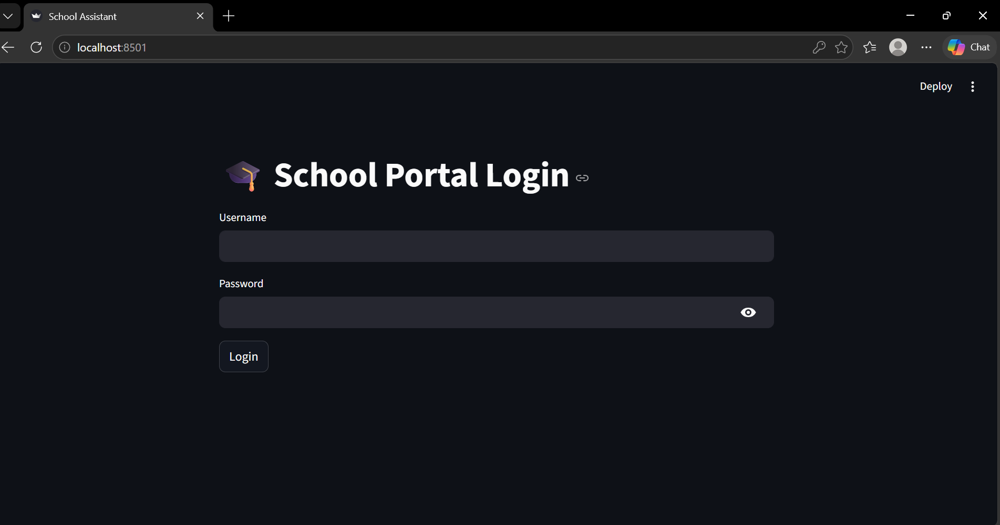
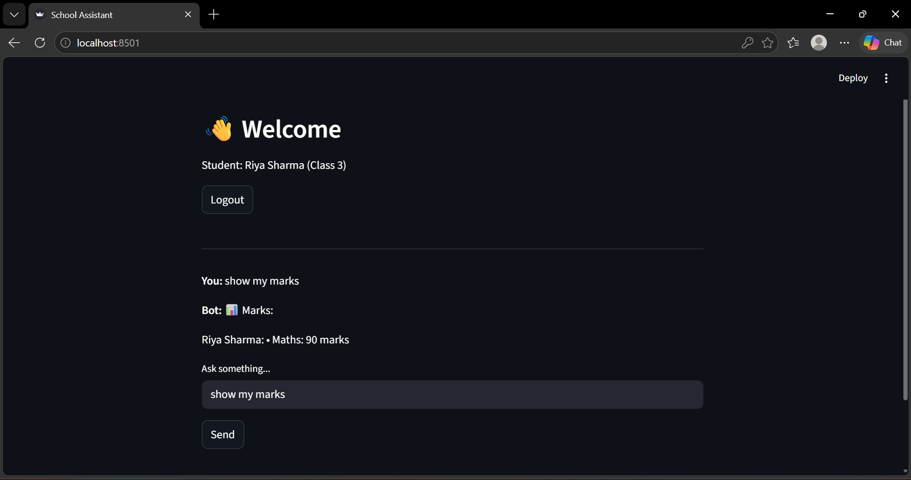
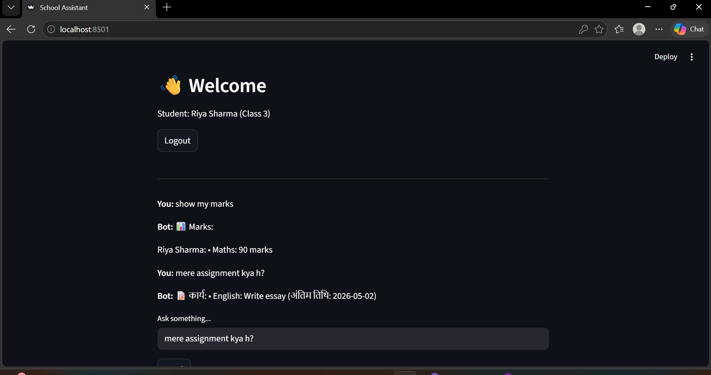

# Multilingual School Chatbot (NL → SQL + RAG)

## Overview

This project is an AI-powered chatbot designed for students and parents to access academic information using natural language queries.

It integrates:

* Natural Language to SQL (NL → SQL) for structured data retrieval
* Retrieval-Augmented Generation (RAG) for contextual responses

The system supports English, Hindi, and Hinglish queries.

---

## Key Features

### Student Access

* View subject-wise marks
* Check assignments with deadlines
* Access class timetable

### Parent Access

* View data for up to 2 children
* Monitor academic performance
* Track assignments and schedules

---

## AI Functionality

* Intent detection and query normalization
* SQL-based data retrieval
* Semantic search using embeddings (RAG)
* Multilingual query handling

---

## Multilingual Support

The chatbot supports:

* English
* Hindi
* Hinglish (mixed language)

Example queries:

```
show my marks
mere marks dikhao
assignment kya hai
```

---

## System Architecture

```
User (Streamlit Frontend)
        ↓
FastAPI Backend (app.py)
        ↓
Chatbot Engine (chatbot.py)
     ↙           ↘
SQLite DB        RAG Module (rag.py)
```

---

## Tech Stack

| Component | Technology            |
| --------- | --------------------- |
| Frontend  | Streamlit             |
| Backend   | FastAPI               |
| Database  | SQLite                |
| AI/NLP    | Sentence Transformers |
| Language  | Python                |

---

## Project Structure

```
School-Chatbot/
│
├── app.py
├── chatbot.py
├── rag.py
├── database.py
├── frontend.py
├── requirements.txt
└── README.md
```

---

## Setup Instructions

```bash
pip install -r requirements.txt
python database.py
uvicorn app:app --reload
streamlit run frontend.py
```

---
## Screenshots

### Login Page


### Chat Interface


### Hindi Query Example


## Demo Credentials

| Username | Password | Role    |
| -------- | -------- | ------- |
| rahul    | 123      | Student |
| riya     | 123      | Student |
| aman     | 123      | Student |
| rajesh   | 123      | Parent  |
| sunita   | 123      | Parent  |

---

## Example Queries

* Show my marks
* Assignments kya hai
* Timetable batao
* What is assignment

---

## Security and Business Rules

* Role-based access control
* Students can access only their own data
* Parents can access only their children’s data
* Maximum 2 children per parent
* Data privacy enforced

---

## Performance

* Response time under 3 seconds
* Supports 1000+ student records
* Efficient SQL queries with lightweight RAG

---

## Future Enhancements

* Voice-based interaction
* Mobile application
* Advanced authentication (JWT)
* Analytics dashboard

---

## Conclusion

This project demonstrates a practical AI application combining backend development, database design, and natural language processing to build a real-world chatbot system.

---

## Author

Developed as part of an AI/Data Science project.
